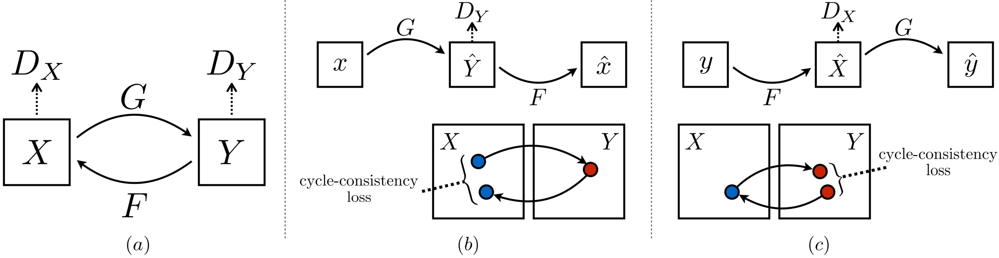

[Zhu, Jun-Yan et al. IEEE International Conference on Computer Vision (2017):2242-2251.](https://arxiv.org/abs/1703.10593)

$$a = b$$

## 1. Introduction

Motivation:

- Having seen the paintings of Monet, We could easily imagine how would he render a scene without a side by side example of a Monet painting next to a photo of that scene.
- Previous research has produced powerful image-to-image translation system in the supervised setting. However, obtaining paired training data is expensive, typically requiring artistic authoring, and difficult, since the desired output cannot be well-defined.

Goal:

- To learn a system that can capture special characteristics of one image collection and figuring out how these characteristics could be translated into the other image collection, all in the absence of any paired training examples.
- Assume that there is some underlying relationship - for example, two images are just two different rederings of the same underlying world - and seek to learn that relationship.

Means:

- Given one set of images in doamin $X$ and a different set in domain $Y$, we can train a mapping $G: X \rightarrow Y$ s.t. the output $\hat{y} = G(x), x \in X$ is indistinguishable from $y \in Y$ by an adversary trained to classify $\hat{y}$ apart from $y$.
- However, doing so does not guarantee that $x$ and $y$ are paired in a meaningful way. Moreover, conventional training procedure often lead to mode collapse, where all input images map to the same output image and the optimizer stop progressing.
- Therefore, the objective needs "cycle consistency". Just like if we translate a sentence from English to French, and then translate it back from French to English, we should arrive back at the original sentence.
- Addition to the adversary losses on domain $X$ and $Y$: Given to translators $G: X \rightarrow Y$ and $F: Y \rightarrow X$, train $G$ and $F$ simultaneously with the default adversary losses, and add a cycle consistency loss that encourages $F(G(x)) \approx x$ and $G(F(y)) \approx y$.

## 2. Formulation

### 2.1. Adversarial Loss

### 2.2. Cycle Consistency Loss

### 2.3 Full Objective

## 3. Implementation Details

## 4. Results
