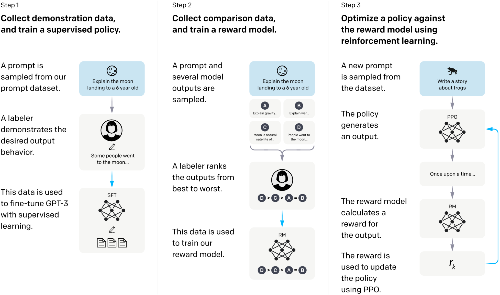

[Long et al., 2022. Neural Information Processing System, NeuralIPS'22.](https://arxiv.org/abs/2203.02155)

## Introduction

Prompt plus LLM is impressive but still has flaws like making up facts, generating biased or toxic text, or simply not following user instructions. This is because the objective -- predicting the next token -- is just utterly different from the objective "following the user's instructions helpfully and safely", or simply speaking, misaligned.

Making the goals more clear: we want the LLM to be (1) helpful, they should help users solve their task; (2) honest, they should not fabricate information or mislead the user; and (3) harmless, they should not cause physical, psychological, or social harm to people or the environment).

The overview of the RLHF method is illustrated in the figure below.

## Methods and Experimental Details

## Results

## Discussions
