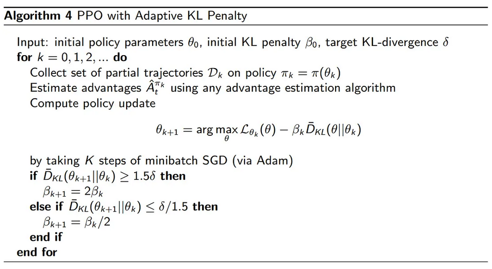
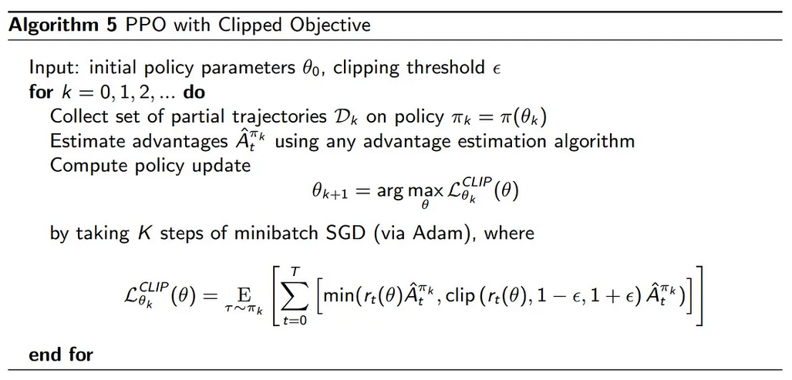

[Schulman et al., 2017 ArXiv.](https://arxiv.org/pdf/1707.06347.pdf)

A journey from REINFORCE to the go-to algorithm in continuous control.

## Vanilla Policy Gradient

In policy-based methods, the function is defined by a set of tunable parameters $$\theta$$. We can adjust these parameters, observe the differences in resulting rewards, and update $$\theta$$ in the direction that yields higher rewards. Formally, we can express the general objective as:

$$J(\theta) = E_{\tau\sim\pi_\theta}R(\tau) = \sum_\tau P(\tau;\theta)R(\tau)$$

With the reward signal and the update direction provided by the objective, we can update the parameters by applying the standard gradient method:

$$\theta \leftarrow \theta + \alpha\nabla J(\theta)$$

However, the problem is we don't know how much ($$\alpha$$) we should update the policy. Besides, due to the risk of large policy changes, samples are only used once. In summary, the vanilla policy gradient suffers from three major drawbacks:

1. Sample inefficiency;
2. Inconsistent policy updates;
3. High reward variance.

## Natural Policy Gradient

To address the learning rate problem (how much we should update the policy), Natural Policy Gradient embeds KL-divergence to restrct the gradient update:

$$\Delta\theta^* = \underset{\mathcal{D}_{KL}(\pi_\theta\Vert\pi_{\theta+\Delta\theta})\leq\varepsilon}{\text{argmax}}J(\theta+\Delta\theta)$$

Doing so replace the hard-to-determine learning rate $$\alpha$$ with a dynamic learning rate, depending on local sensitivity of the objective function. In theory, natural gradients ensure stable updates with appropriate step sizes and improve sample efficiency due to magnitude restriction. However, in practice:

1. Inversing the Fisher matrix $$F$$ is cumbersome ($$O(N^3)$$);
2. The KL-constraint might not be satisfied;
3. Policy improvemnt is not verified.

## Trust Region Policy Optimization (TRPO)

To Address the above issues, Schulman et al. proposed the TRPO in 2015. The derivation is too complex to detail here so I will points out two key equations here. First, the surrogate advantage $$\mathcal{L}_{\pi_\theta}$$ -- rooted in importance sampling -- reflects the expected advantage of an update:

$$\begin{align*}\mathcal{J}(\pi_{\theta+\Delta\theta})&-\mathcal{J}(\pi_\theta) \\ &\approx \mathbb{E}_{s\sim \rho_{\pi_\theta}}\frac{\pi_{\theta+\Delta\theta}(a|s)}{\pi_\theta(a|s)}A^{\pi_\theta}(s, a) \\ &= \mathcal{L}_{\pi_\theta}(\pi_{\theta+\Delta\theta}) \end{align*}\\$$

Second, we can bound the approximation error of the surrogate advantage by means of the worst-case KL-divergence between the policies before and after updating, which yields the following inequality:

$$\begin{align*} \mathcal{J}(\pi_{\theta+\Delta\theta})&-\mathcal{J}(\pi_\theta) \\&\geq \mathcal{L}_{\pi_\theta}(\pi_{\theta+\Delta\theta})-C\cdot D_{KL}^{max}(\pi_\theta\Vert\pi_{\theta+\Delta\theta}) \end{align*}$$

Despite its widespread adoption, TRPO has a numbers of shortcomings:

1. Inability to handle large parameter matrices;
2. Second-order optimization is slow;
3. TRPO is complicated.

## Proximal Policy Optimization (PPO)

In 2017, Schulman et al. introduced Proximal Policy Optimization (PPO), building on the TRPO foundations. There are two main variants of PPO: PPO Penalty and PPO Clip.

### PPO with Adaptive KL Penalty

The theoretical TRPO analytically derives a penalty to multipy with the divergence, yet in practice this penalty is often overly restrictive, yielding only very minor updates:

$$\begin{align*} \Delta\theta^* = &\argmax_{\Delta\theta}\mathcal{L}_{\theta+\Delta\theta}(\theta+\Delta\theta) \\ &- \beta(\mathcal{D}_{KL}(\pi_\theta\Vert\pi_{\theta+\Delta\theta})) \end{align*}$$

It is very hard to determine a single value for $$\beta$$ that works for multiple problem settings. PPO solves this problem by setting a target divergence $$\delta$$. We would like our updates to be somewhere within the neighborhood of this divergence. Simply speaking, the target divergence should be large enough to substantially alter the policy, but small enough for updates to be stable.

### PPO with clipped objective

Clipped PPO is typically what we mean when discussing "PPO". It usually outperforms the penalty-based variant and is simpler to implement. Rather than bothering with changing penalties over time like its twin, Clippend PPO simply restricts the range within which the policy can change, such that advantages achieved by updates outside the clipping range are not used for updating purposes. The full algorithm is detailed below.

