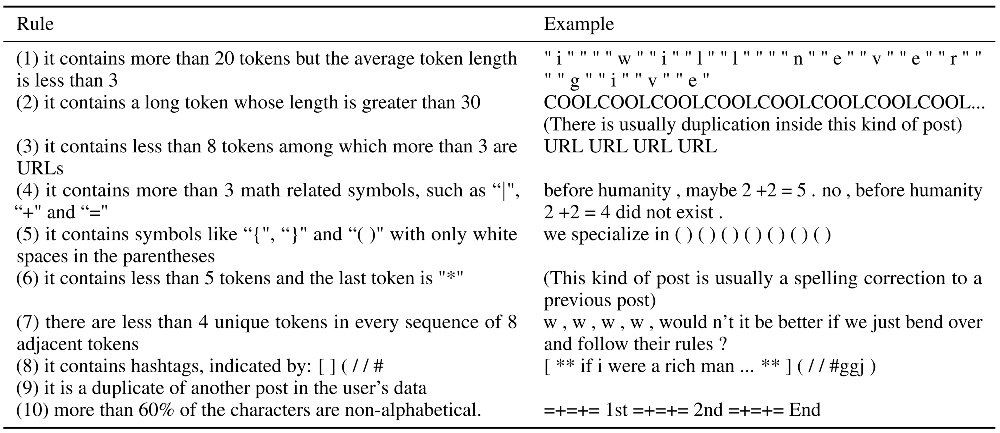
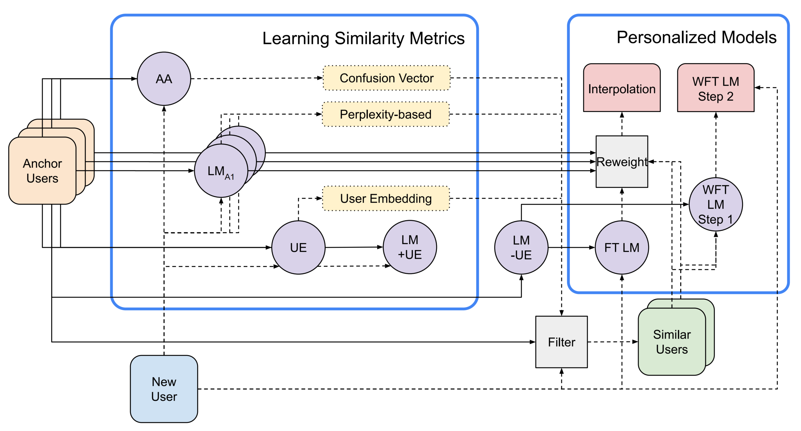

[Welch et al., 2022. ACL Volume 1: Long Papers, pp.1742-1752](https://aclanthology.org/2022.acl-long.122.pdf)

## Introduction

This paper focus on personalization in language modeling, which can be applied to predictive text, authorship attribution, and dialog systems. Approaches like fine-tuning can be used to tailor a pretrained model to an individual, but perform well only when enough data is available. It is more practical to consider the case of a new user with a small number of available tokens and design methods to find similar users then leverage data from them to build a personalized LM.

## Dataset

The Dataset consists of a corpus of publicly available Reddit comments ([Link](https://www.reddit.com/r/datasets/comments/3bxlg7/i_have_every_publicly_available_reddit_comment/)). Anchor users refer to the users who are active between 2007 and 2015 with at least 250k tokens of text. Rules for preprocessing are described in the figure below:

## Experiments

Given a set of users $$\texttt{anchors}$$, a new user $$n$$, and a similarity function $$\texttt{sim}$$, we can compute $$z = \texttt{sim}(n, \texttt{anchors}), z \subset \texttt{anchors}$$ to get a set of similar users. The overall architecture is described in the figure below:

### Calculating User Similarity

Three methods for measuring the similarity:

1. Authorship Attribution Confusion can be treated as a vector of continuous values where each value represents the similarity to an anchor user. 
2. User embeddings result in a vector space where we use cosine similarity to directly measure the distance between individuals.
3. Perplexity-based similarity directly gives a distance between each pair of users.

### Leveraging Similar Users

Two methods to learn from the data to construct a personalized LM:

1. Weighted Sample Finetuning relies on the assumption that users who speak in a similar style or about similar content should be similar. It first finetune the model trained on all anchor users on a new set of similar users and then tuning on the new user's data.
2. Interpolation Model takes the predictions from individual LMs trained for each anchor user and weigh them according to that anchor's similarity to the new user. 