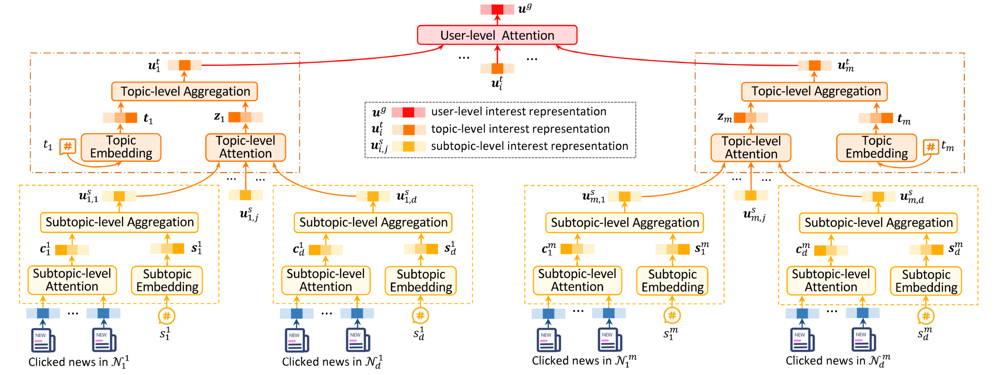

[Qi et al., ACL'21. pp. 5446-5456](https://arxiv.org/abs/2106.04408)

## Introduction

Using a single representation to model user interests is problematic as they are usually diverse and multi-grained. HieRec tackles this problem by divide the user interest into three levels:

1. Subtopic level, which models fine-grained user interests in different news subtopics (e.g., football and golf).
2. Topic level, which captures coarse=grained user interests in major news topics (e.g., sports and finance).
3. User level, which models overall user interests.

## Method

### Formulation

Given a candidate news $$n_c$$ and a target user $$u$$, the goal is calculating an interest score $$o$$ to measure the interest of this user in the candidate news. Each news $$n$$ has a tilte, a topic $$t$$ and a subtopic $$s$$. The title is composed of a text sequence

$$T = [w_1,w_2,\dots,w_{|T|}]$$

and an entity sequence

$$E = [e_1,e_2,\dots,e_{|E|}]$$

We assume the user has $$M$$ clicked news. In HieRec, we further divide these clicks based on their topics and subtopics, more specificially, we build a clicked topic set

$${t_i|i=1,\dots,m}$$

from topics of user's clicks, where $$t_1$$ is the i-th clicked topic and m is the number of clicked topics. In the same way, we can further obtain a clicked subtopic set

$${s_j^i|j=1,\dots,d}$$

subordinate to each clicked topic $$t_1$$. Finally, user's clicked news in topic $$t_i$$ and subtopic $$s_i^j$$ are divided into the same click group

$$\mathcal{N}_j^i = \{n_k^{i,j}|k=1,\dots,l\}$$

### Hierarchical User Interest Modeling

As introduced in the previous section, HieRec represents user interests via a three-level hierarchy.

First, it learns multiple subtopic-level interest representations to model fine-grained user interests in different news subtopics (e.g. football and golf). The subtopic-level interest representation for subtopic $$s_j^i$$ is learned from $$\mathcal{N}_j^i$$ that is composed of user's clicked news in subtopic $$s_j^i$$. The model uses a subtopic-level attention network to select informative clicked news for modeling user interest in subtopic $$s_j^i$$:

$$\mathbf{c}_j^i = \sum_{k=1}^l\gamma_k \mathbf{n}_k^{i,j},\:\gamma_k=\frac{\exp(\phi_s(\mathbf{n}_k^{i,j}))}{=\sum_{p=1}^l\exp(\phi_s(\mathbf{n}_p^{i,j}))}$$

where $$\phi_k$$ denotes the attention weight of the k-th clicked news $$n_k^{i,j}$$ in $$\mathcal{N}_j^i$$, $$\mathbf{n}_k^{i,j}$$ is the representation of news $$n_k^{i,j}$$ and $$\phi_s(\=\cdot)$$ denotes a dense network.