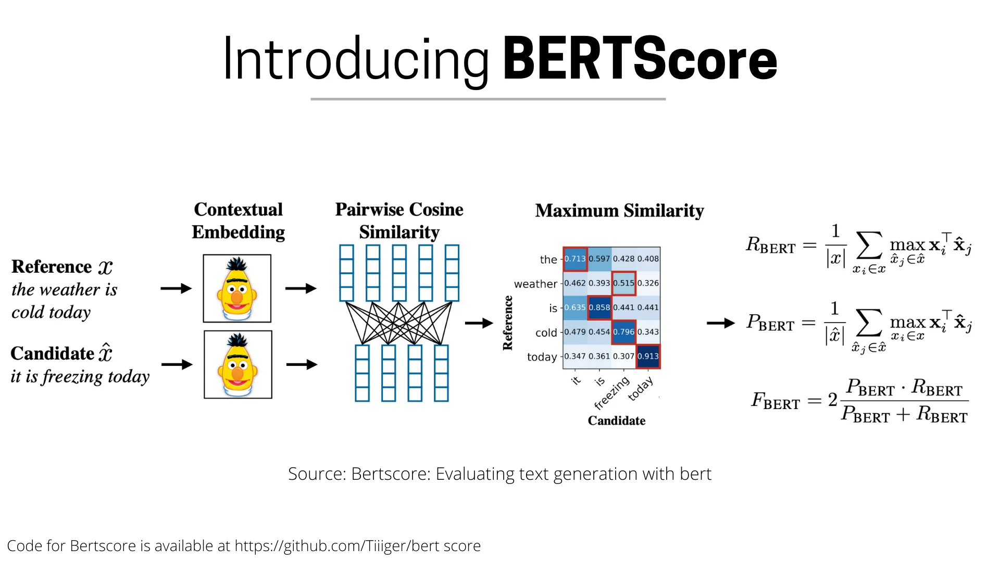

## For Similarity

### ROUGE

The Recall-Oriented Understudy for Gisting Evaluation is introduced by [Chin-Yew Lin, 2004](https://aclanthology.org/W04-1013/). It is based on calculating the syntactic overlap between candidate and reference summaries. Given a System Summary (what the model produced) and a Reference Summary (i.e. gold standard, usually from humans):

> sys: the cat was found under the bed \
> ref: the cat was under the bed

The **ROUGE-1-recall** measures how much the reference summary the system summary is recovering:

$$\texttt{ROUGE-1}_\texttt{recall} = \frac{\text{\# overlapping unigram}}{\text{\# unigrams in reference}} = \frac{6}{6} = 1$$

The **ROUGE-1-precision** measures how much of the system summary was in fact relevant:

$$\texttt{ROUGE-1}_\texttt{precision} = \frac{\text{\# overlapping unigram}}{\text{\# unigrams in system}} = \frac{6}{7} = .86$$

- **ROUGE-N** measures unigram, bigram, trigram, and higher order n-gram overlap.
- **ROUGE-L** measures longest matching sequence of words (Longest Common Subsequence).
- **ROUGE-S** measures any pair of words in a sentence in order, allowing for arbitrary gaps (skip-gram concurrence).

### BLEU

The Bilingual Evaluation Understudy Score is introduced by [Papineni et al., 2002](https://aclanthology.org/P02-1040/). To solve the repetition and multiple targets problems, modifiy precision to be clipped-precision, for example:

> target 1: he eats a sweet apple \
> target 2: he is eating a tasty apple \
> predict: he he he eats tasty fruit

| word | matching | matched count | clipped count |
| :-: | :-: | :-: | :-: |
| he | both | 3 | 1 |
| eats | target 1 | 1 | 1 |
| tasty | target 2 | 1 | 1 |
| fruit | none | 0 | 0 |
| **total** | | 5 | 3 |  

$$\texttt{Clipped-Precision} = \frac{\text{clipped num. correct predictions}}{\text{num. total predictions}} = \frac{3}{6} = .5$$

Given a Target Sentence and a Predicted Sentence:

> target: the guard arrived late because it was raining \
> predict: the guard arrived late because of the rain

This is how BLEU score calculated: Firstly, calculate clipped-precision for unigram, bigram, trigram, and 4-gram:

$$\texttt{CP}_1 = \frac{5}{8}, \texttt{CP}_2 = \frac{4}{7}, \texttt{CP}_3 = \frac{3}{6}, \texttt{CP}_4 = \frac{2}{5}$$

Secondly, calculate the Geometric Average Prcision Scores:

$$\begin{align*} \texttt{GAP}(N) &= \exp(\sum_{n=1}^Nw_n\log p_n) = \prod_{n=1}^N p_n^{w_n} \\&= (\texttt{CP}_1)^{\frac{1}{4}}*(\texttt{CP}_2)^{\frac{1}{4}}*(\texttt{CP}_3)^{\frac{1}{4}}*(\texttt{CP}_4)^{\frac{1}{4}} \end{align*}$$

Thirdly, compute the Brevity Penalty:

$$\texttt{BP} = \begin{cases}1, & c > r \\ e^{1-\frac{r}{c}}, & c \leq r \end{cases}$$

where **c** is predicted length and **r** is target length. Finally, the BLEU score is calculated as follow:

$$\begin{align*} \texttt{BLEU}(N) &= \texttt{BP}*\texttt{GAP}(N), \text{ alternatively, } \\ \log \texttt{BLEU}(N) &= \min(1-\frac{r}{c}, 0)+\sum_{n=1}^N\frac{\log p_n}{N} \end{align*}$$

- BLEU-1 uses the unigram CP.
- BLEU-2 uses the GAP of unigram and bigram CP
- BLEU-3 uses the GAP of unigram, bigram, and trigram CP.
- and so on.

### METEOR

The Metric for Evaluation of Translation with Explicit ORdering is introduced by [Banerjee and Lavie, 2005](https://www.cs.cmu.edu/~alavie/papers/BanerjeeLavie2005-final.pdf?ref=blog.paperspace.com). It is claimed that the metric has a high correlation with huamn judgement. Given a predicted sentence and a reference sentence:

> pred: the cat sat on the mat \
> ref: on the mat sat the cat

This is how a METEOR score is calculated: Firstly, compute the unigram F-score:

$$\begin{align*} P &= \frac{\text{num. matched}}{\text{num. pred}} = \frac{6}{6} = 1 \\ R &= \frac{\text{num. matched}}{\text{num. ref}} = \frac{6}{6} = 1 \\ F & = \frac{10*P*R}{R + 9P} = 1\end{align*}$$

Secondly, compute the Chunk Penalty, which gives a penalty based on the number mathcing consecutive words:

$$CP = 0.5(\frac{\text{num. chunks pred.}}{\text{nums. unigram pred.}})^3 = 0.5(\frac{3}{6})^3 = 0.0625$$

Finally, the METEOR score is the combination of the unigram F-score with chunk penalty:

$$M = F(1 - CP) = 1(1 - 0.0625) = 0.9375$$

### BERT-score

The BERT-score is introduced by [Zhang et al., 2020](https://arxiv.org/abs/1904.09675?ref=blog.paperspace.com). Instead of relying on syntactic overlaps, it makes use of its semantic capability to generate the contextualized embeddings for both prediction and reference, then measure their similarity using cosine similarity:

### CIDEr-score

The Consensus-based Image Description Evaluation is introduced by [Vedantam, Zitnick, and Parikh, 2015](https://www.cv-foundation.org/openaccess/content_cvpr_2015/papers/Vedantam_CIDEr_Consensus-Based_Image_2015_CVPR_paper.pdf). Intuitively, a measure of consensus would encode how often n-grams in the candidate sentence are present in the reference sentences. Similarly, n-grams not present in the reference sentences should not be in the candidate sentence. Finally, n-grams that commonly occur across all images in the dataset should be given lower weight, which can be done by TF-IDF weighting fro each n-gram.

## For Diversity

### Self-BLEU

Self-BLEU, proposed by [Zhu et al., 2018](https://arxiv.org/pdf/1802.01886.pdf?ref=blog.paperspace.com), is a smart use of the traditional BLEU metric for capturing and quantifying diversity in the generated text. The algorithm is pretty straightforward:

1. Pcik a sentence from a set of generated sentences for a given input. Calculate the BLEU score between this sentence and all other remaining sentences from the set.
2. Iterate over all the unique sentences, generate BLEU scores for all, and store them in a list.
3. Finally, take the average of the list from step 2.

## Task Specific

### Emotion Evaluation

**Emotion-a** and **Emotion-w** are two metrics from [Song et al., 2019](https://aclanthology.org/P19-1359.pdf) that evaluates How well the emotion is expressed in the generated responses. Emotion-a is the agreement between the predicted labels through a trained classifier, while Emotion-w is the percentage of the generated responses that contain the corresponding emotional words.
